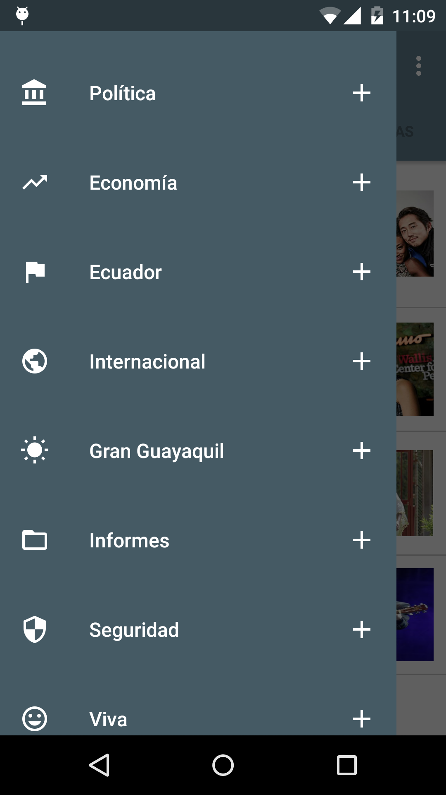
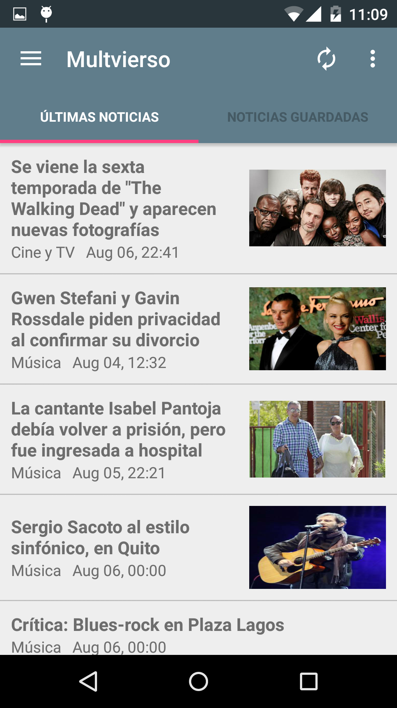
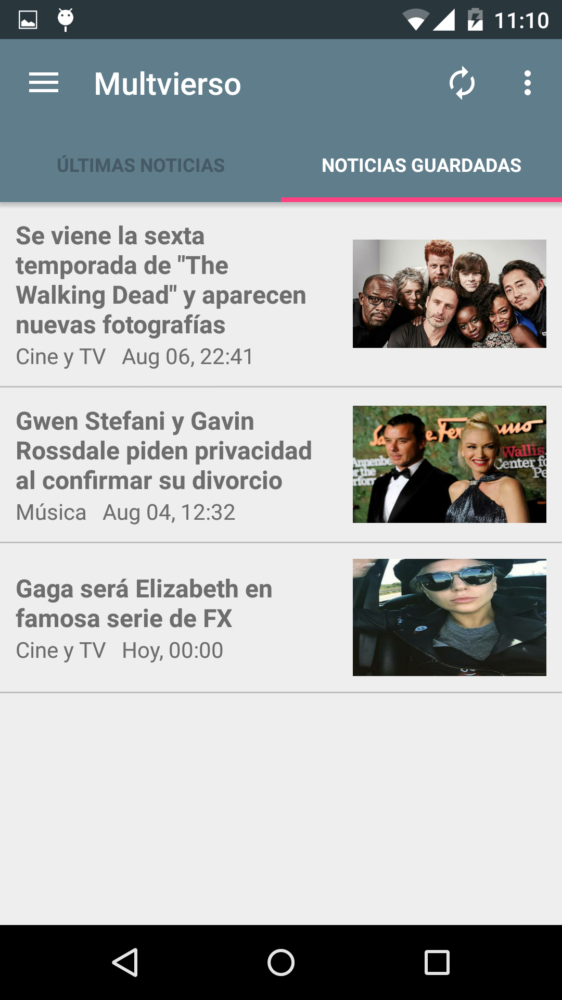

# Multiverso

With Multiverso you can check the latest news from Diario El Universo, Ecuador.

- Select as many feeds as you want to subscribe.<br/>

<br/><br/>
- Get the latest news in a list for easy scan.<br/>

<br/><br/>
- Read the description of an Entry, and even read more!<br/>

<br/><br/>
- Also, save some news if you want to read them later.<br/>



####Requirements####
- Android SDK 16+ (Target SDK 22)

####Building from the command line####
- Set JAVA_HOME environment variable.
```
$ export JAVA_HOME=/usr/lib/jvm/jdk1.7.0
```
- Install [Gradle v2.2.1](http://gradle.org/gradle-download/) Binary.
```
$ export GRADLE_HOME=/<installation location>/gradle-2.2.1
$ export PATH=${PATH}:$GRADLE_HOME/bin
```
- Test Gradle. Should give you BUILD SUCCESSFUL
```
$ gradle
```
- Navigate to the root of the project and execute the next code to compile:
```
$ keytool -genkey -v -keystore debug.keystore -alias androiddebugkey -storepass android -keypass android -keyalg RSA -validity 14000
$ gradle assembleRelease
```
- Install adb and run the application on a connected device:
```
$ sudo apt-get install android-tools-adb
$ adb -d install app/build/outputs/apk/app-release.apk
```


>Material Design Icons by [Google](https://github.com/google) are licensed under [CC BY 4.0](https://creativecommons.org/licenses/by/4.0/).
>This project follows the structure suggested by [Futurice](https://github.com/futurice/android-best-practices).
